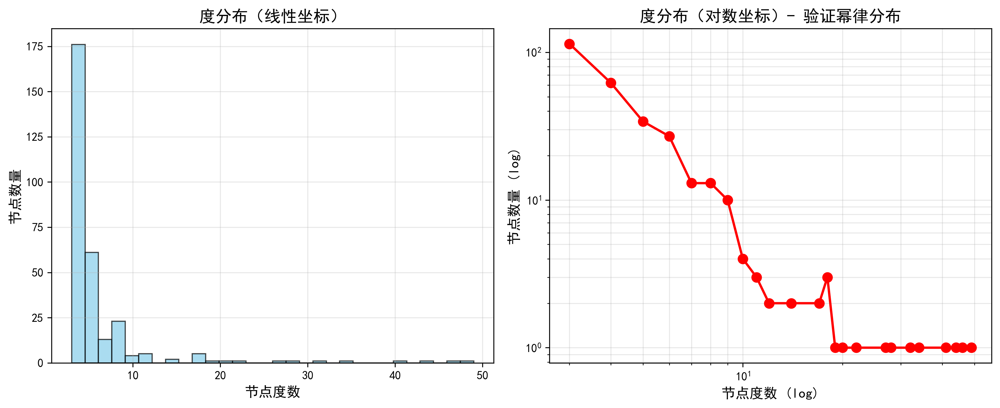
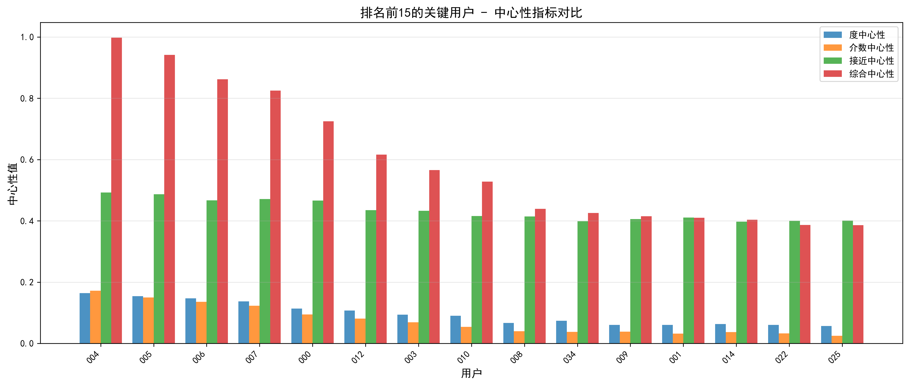
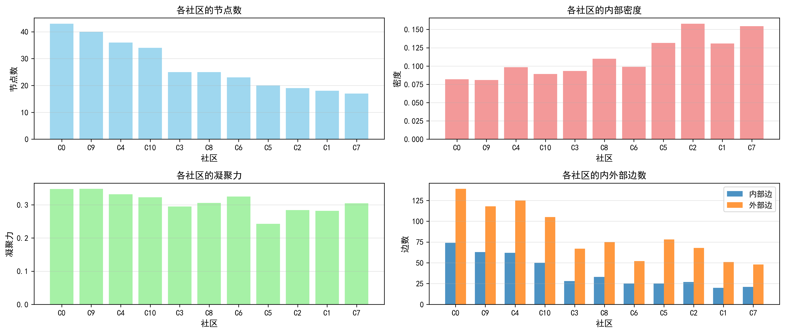

# 🌐 社交网络图论分析系统

- 项目类型：课程设计 | 图论 + 社交网络分析
- 技术栈：Python, NetworkX, Matplotlib, Pandas, NumPy, Streamlit, python-louvain
- 运行方式：交互式（Streamlit）/ 命令行导出（main.py）
- 更新时间：2025-12-16

备注：本 Markdown 可直接用于生成幻灯片（Marp/Pandoc/Reval.js）。见文末“导出为 PPT/PDF”。

---

## 目录

1. 项目背景与目标
2. 亮点特性概览
3. 系统架构与目录
4. 运行与演示方式
5. 数据生成（BA 模型）
6. 网络分析（基本指标与中心性）
7. 社区检测（Louvain/GN）
8. 可视化方案
9. 交互式应用（Streamlit）
10. 命令行批量产物
11. 示例结果展示
12. 性能与缓存策略
13. 常见问题（FAQ）
14. 总结与展望
15. 导出为 PPT/PDF

---

## 1. 项目背景与目标

- 背景：在社交网络中，如何识别关键用户、发现社区结构，是图论的重要应用场景。
- 目标：
  - 生成无标度社交网络（BA 模型）
  - 计算基本结构指标与多种中心性，识别关键用户
  - 进行社区检测并分析其结构特性
  - 产出高质量可视化与可下载报告
  - 提供“交互式应用 + 命令行导出”两种演示途径

---

## 2. 亮点特性概览

- 模块化与可复现：随机种子受控，模块清晰，结果可重复
- 社区算法可切换：自动/Louvain（python-louvain/NetworkX）/Girvan–Newman
- 高区分度着色：多调色板聚合 + HSV 补色，避免大量社区颜色重复
- 缓存友好：自定义 Graph 哈希，Streamlit 中安全缓存 nx.Graph
- 交互体验：
  - 侧边栏：网络规模、BA 参数、随机种子、重新生成
  - 顶部：算法选择 + “当前社区数”即时刷新
  - 页面内：用户/社区模糊搜索（下拉框）

---

## 3. 系统架构与目录

- 主要模块：
  - data_generator.py：生成 BA 网络，附加节点/边属性
  - network_analysis.py：基本指标 + 中心性计算与解读
  - community_detection.py：社区检测封装（Louvain/GN）与统计
  - visualization.py：网络/分布/对比/社区统计可视化
  - app.py：Streamlit 交互应用入口
  - main.py：命令行批量导出入口

- 目录结构：
```
NetWork/
├── app.py
├── main.py
├── data_generator.py
├── network_analysis.py
├── community_detection.py
├── visualization.py
├── requirements.txt
├── test_modules.py
├── README.md
├── USAGE.md
└── results/  # 运行后生成图片/CSV/报告
```

---

## 4. 运行与演示方式

- 安装依赖：
```
pip install -r requirements.txt
```
- 交互式运行（推荐）：
```
python -m streamlit run app.py
# 或
streamlit run app.py
```
- 命令行批量导出：
```
python main.py --nodes 300 --m 3 --seed 42 --out ./results
```

---

## 5. 数据生成（BA 模型）

- 模型：Barabási–Albert 无标度网络（优先连接机制）
- 接口：SocialNetworkGenerator.generate_complete_network(n_nodes, m)
- 节点属性：user_id, join_time, activity_level
- 边属性：relationship_type, interaction_count
- 特性：
  - 幂律度分布：少数 hub + 大量低度数节点
  - 小世界：较小的平均最短路径、较高的聚类系数

---

## 6. 网络分析（基本指标与中心性）

- 基本指标：节点数、边数、密度、平均度、（最大/最小）度、平均聚类系数、平均最短路径长度、网络直径、度分布统计
- 中心性：
  - 度中心性：直接连接数量
  - 介数中心性：最短路径中的“桥梁”作用
  - 接近中心性：到全网平均距离
  - 特征向量中心性：处在“重要邻居”之中
- 综合中心性：多指标归一化加权汇总并排序，识别关键用户

---

## 7. 社区检测（Louvain / GN）

- 支持：
  - 自动选择：优先 python-louvain → NetworkX Louvain → 回退 Girvan–Newman
  - 强制选择：Louvain（python-louvain）/ Louvain（NetworkX）/ Girvan–Newman
- 输出：
  - 社区划分映射、社区统计（规模/密度/凝聚力/内外部边）
  - 质量解读：凝聚力越高，社区内部越紧密、外部连接越少

---

## 8. 可视化方案

- 社区着色网络图：高区分度调色，图例多列自适应
- 中心性着色网络图：节点大小/颜色映射综合中心性
- 度分布（线性/对数坐标）
- 中心性对比、社区统计柱状图
- 布局：spring / circular / kamada_kawai

---

## 9. 交互式应用（Streamlit）

- 侧边栏：节点数、BA 参数 m、随机种子、重新生成（清缓存）
- 顶部：算法选择 + 运行按钮；“当前社区数”即时刷新
- 标签页：
  1) 网络基本分析
  2) 关键用户识别（模糊搜索用户）
  3) 社区结构检测（模糊搜索社区）
  4) 网络可视化（社区/中心性）
  5) 统计报告（TXT/CSV 下载）
- 缓存：@st.cache_data(hash_funcs={nx.Graph: custom_hasher})

---

## 10. 命令行批量产物（./results）

- 图片：
  - 01_network_communities.png（社区着色）
  - 02_network_centrality.png（中心性着色）
  - 03_degree_distribution.png（度分布）
  - 04_centrality_comparison.png（中心性对比）
  - 05_community_statistics.png（社区统计）
- 数据：
  - basic_metrics.json（基本指标）
  - centrality.csv（中心性）
  - community_stats.csv（社区统计）
- 报告：report.txt（综合分析文本）

---

## 11. 示例结果展示（部分）

- 社区着色网络图：


---

- 中心性着色网络图：


---

- 度分布（线性/对数）：



---

- 中心性对比与社区统计：





---

## 12. 性能与缓存策略

- 复用计算：对网络分析与社区检测结果进行缓存
- 自定义哈希：仅基于拓扑（节点/边）为 nx.Graph 生成稳定摘要
- 一键刷新：点击“生成/重新生成网络”，清理 cache 后重建
- 规模建议：
  - 演示：100 节点
  - 默认：300 节点
  - 大规模：1000 节点（耗时/内存更高）

---

## 13. 常见问题（FAQ）

- Q: 直接 `python app.py` 不能打开网页？
  - A: 需使用 `streamlit run app.py` 或 `python -m streamlit run app.py`。
- Q: 社区颜色重复？
  - A: 采用多调色板聚合 + HSV 采样的高区分度方案。
- Q: “当前社区数”不刷新？
  - A: 已通过占位符即时刷新；若不一致，强刷或点击“重新生成网络”。
- Q: 想固定 Louvain 的可复现性？
  - A: NetworkX Louvain 已设 seed=42；python-louvain 可在调用处设置 random_state。

---

## 14. 总结与展望

- 项目总结：完成从生成 → 分析 → 社区 → 可视化 → 报告的完整闭环
- 应用价值：适用于课堂演示、作业报告与初步研究
- 后续方向：
  - 引入真实数据集（如 SNAP）
  - 更多社区质量指标（模块度、NMI 等）
  - 交互优化与多图联动

---

## 15. 导出为 PPT/PDF（建议）

- 方案 A：Marp（推荐简便）
```
# 安装（需 Node.js）
npm i -g @marp-team/marp-cli
# 导出为 PDF 或 PPTX
marp PRESENTATION.md -o slides.pdf
marp PRESENTATION.md -o slides.pptx
```

- 方案 B：Pandoc + Reveal.js（更灵活）
```
pandoc PRESENTATION.md -t revealjs -s -o slides.html
# 或 Beamer（LaTeX）
pandoc PRESENTATION.md -t beamer -o slides.pdf
```

- 方案 C：VS Code 插件 Marp / Markdown Preview Enhanced 直接导出

---

谢谢聆听！

联系：________ | Git / 邮箱：________

